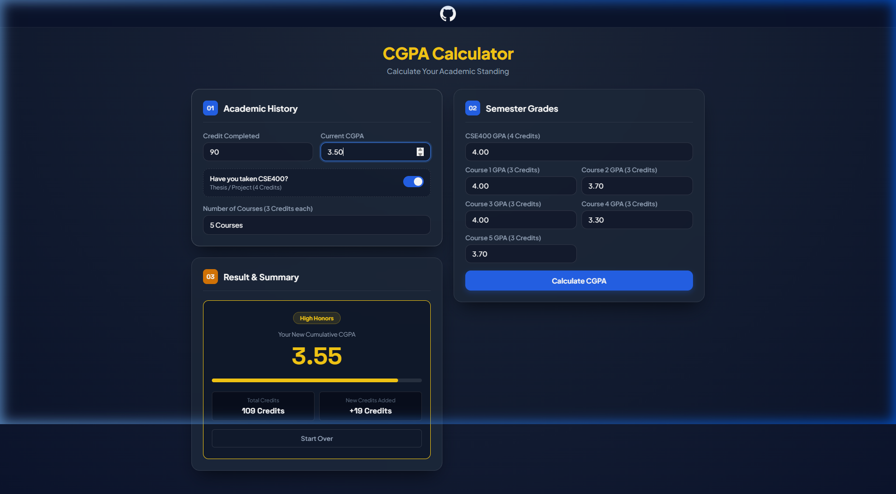

# CGPA Calculator
A clean, responsive, and easy-to-use CGPA calculator tailored specifically for **BRAC University (BRACU)** students.

## Preview

## Features
- Completed Credits & Current CGPA Input
- Dynamic Course Selector
- Special CSE400 Support
- Instant & Accurate Calculation
- Clean UI

## Live Demo
You can try out the live web app directly at: **[CGPA Calculator](https://niloyahsan1.github.io/cgpacheck/)**

## How It Works
The calculator uses the standard weighted GPA formula:
$$\text{New CGPA} = \frac{(\text{Completed Credits} \times \text{Current CGPA}) + \sum (\text{Course Credits} \times \text{Course GPA})}{\text{Total Credits (Completed + New)}}$$

- **Regular Courses**: Weighted at **3.0 credits** each.
- **CSE400 (if selected)**: Weighted at **4.0 credits**.

## Built With
- HTML5
- CSS3
- JavaScript (Vanilla)

## Developed By
- [Niloy Ahsan](https://github.com/niloyahsan1)